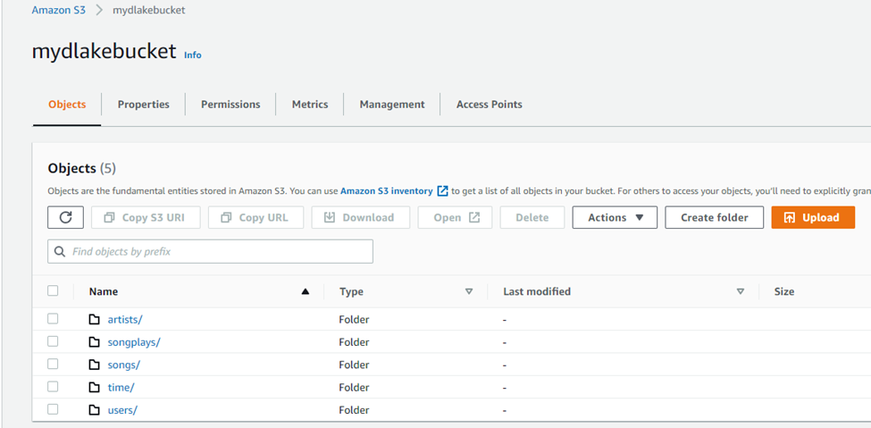
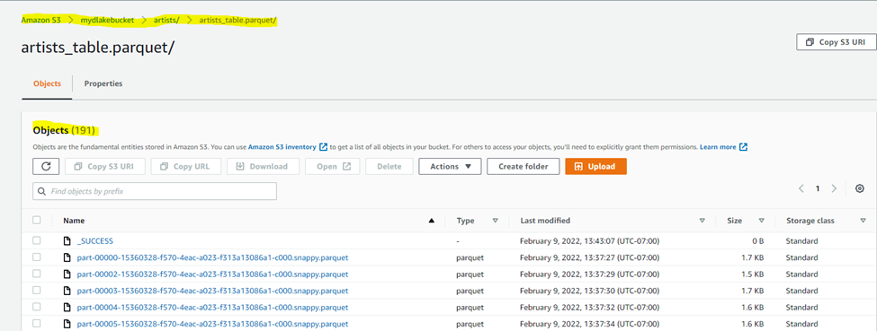
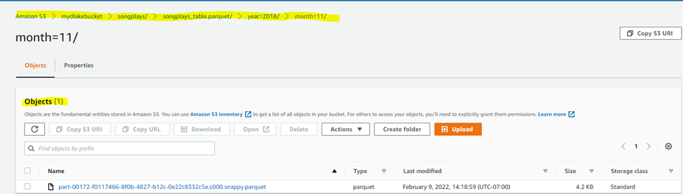
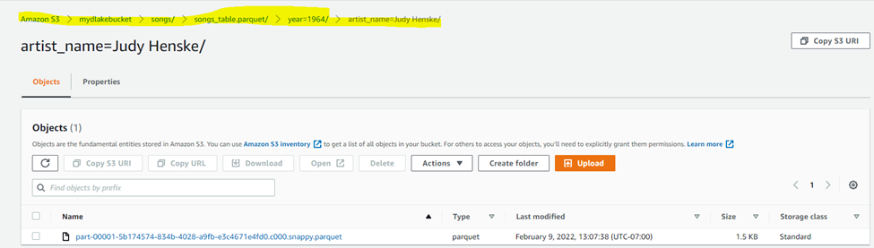
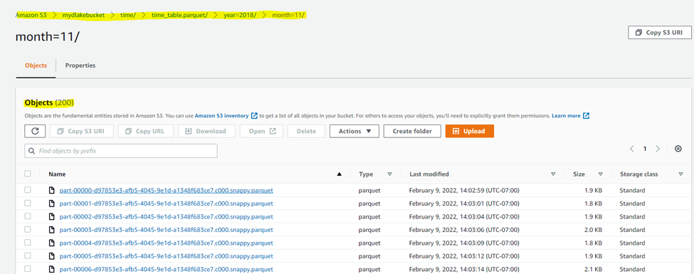

# Purpose:

A music streaming startup, **Sparkify**, has grown their user base and song database even more and want to move their data warehouse to a data lake. Their data resides in S3, in a directory of JSON logs on user activity on the app, as well as a directory with JSON metadata on the songs in their app.

The purpose of this project is to extract data from S3, process the data into analytics tables using Spark, and load them back into S3 so that the analytics team can analyze the data.

## Datasets:

The following two datasets that reside in S3 are used:

**Song dataset**:
Dataset contains metadata about a song and the artist of that song. Each file is in JSON format. The files are partitioned by the first three letters of each song's track ID.

***Location***: s3://udacity-dend/song_data

***Sample record from a file https://udacity-dend.s3.us-west-2.amazonaws.com/song_data/A/A/A/TRAAAAK128F9318786.json***:

{"artist_id":"ARJNIUY12298900C91","artist_latitude":null,"artist_location":"","artist_longitude":null,"artist_name":"Adelitas Way","duration":213.9424,"num_songs":1,"song_id":"SOBLFFE12AF72AA5BA","title":"Scream","year":2009}

**Log Dataset**:
Dataset consists of log files generated by the simulator based on the songs in the Song dataset. Each file is in JSON format. The files are partitioned by year and month.

***Location***: s3://udacity-dend/log_data

***Sample record from a file https://udacity-dend.s3.us-west-2.amazonaws.com/log_data/2018/11/2018-11-01-events.json***:

{"artist":null,"auth":"Logged In","firstName":"Walter","gender":"M","itemInSession":0,"lastName":"Frye","length":null,"level":"free","location":"San Francisco-Oakland-Hayward, CA","method":"GET","page":"Home","registration":1540919166796.0,"sessionId":38,"song":null,"status":200,"ts":1541105830796,"userAgent":"\"Mozilla\/5.0 (Macintosh; Intel Mac OS X 10_9_4) AppleWebKit\/537.36 (KHTML, like Gecko) Chrome\/36.0.1985.143 Safari\/537.36\"","userId":"39"}

## Design:

In this project, all the records from the folder song_data and log_data are copied into the Spark dataframes and then the **songs** and **logs** temporary views are created from the dataframes.
The following five tables are created and writes them to partitioned parquet files in table directories on S3:
1. songs table - partitioned by year and artist
2. artists table
3. users table
4. time table - partitioned by year and month
5. songplays table - partitioned by year and month

ETL pipeline reads song_data and load_data from S3, transforms them to create five different tables, and writes them to partitioned parquet files in table directories on S3.

## Prerequisites:

1. AWS account and access keys
2. Create S3 storage to store the output files and directories
3. Create an EMR cluster

## Execution steps:

1. Run etl (**command**: `python etl.py`) script in the terminal. This script will reads song_data and load_data from S3, transforms them to create five different tables, and writes them to partitioned parquet files in table directories on S3.

## Final steps (clean up the resources):

1. Terminate EMR cluster
2. Delete S3 storage

## Output from etl.py

The following output is from executing the partial files('song_data/A/A/*/*.json') from song_data and all the files from log data. These took more than 1 and half hours to complete.
***** Create spark session took 12.03 seconds. ******
***** Completed writing songs table *****            
***** Completed writing artists table *****          
***** Process song data took 3626.00 seconds. ******
***** Completed writing users table *****           
***** Completed writing time table *****            
***** Completed writing songplays table *****       
***** Process log data took 2153.48 seconds. ******
***** Overall process took 5791.56 seconds. ******

## Sample directory structure from S3

